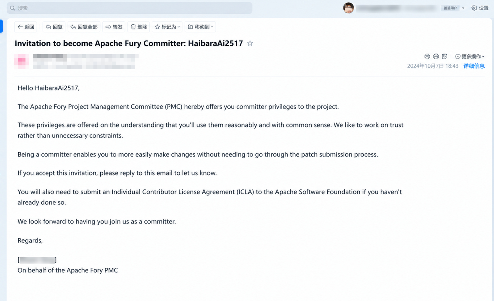
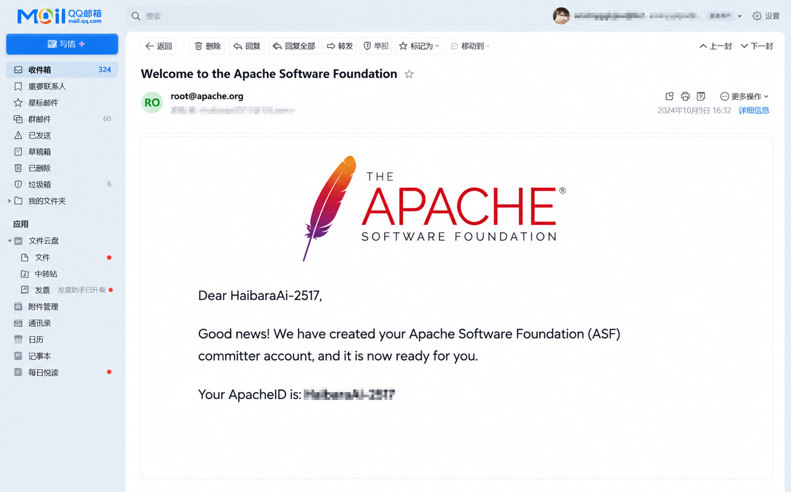
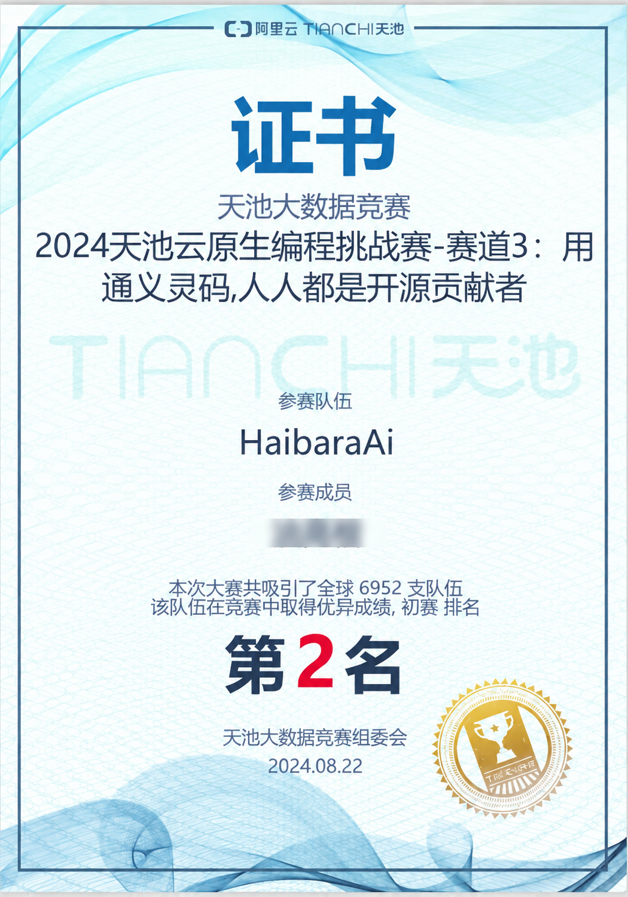
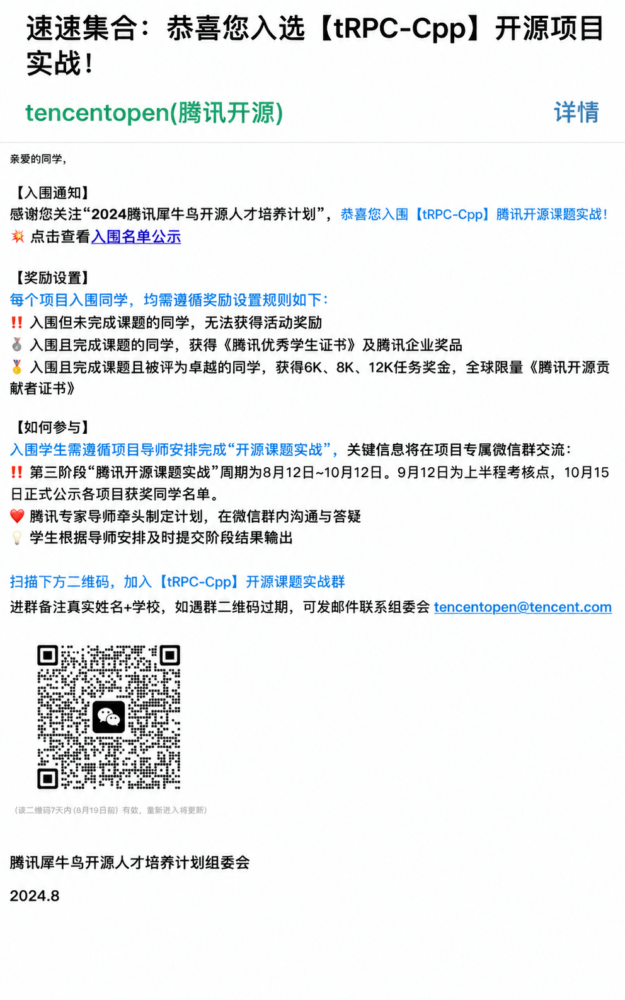
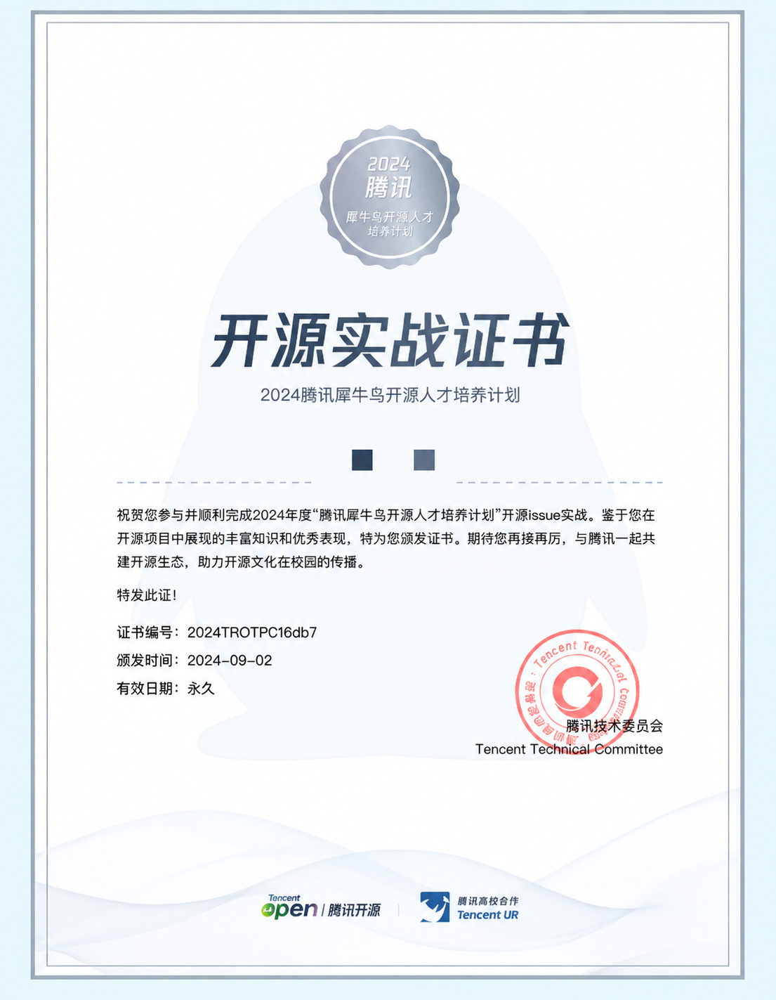
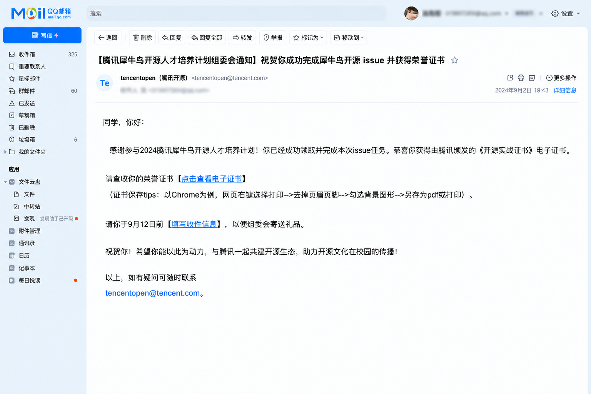
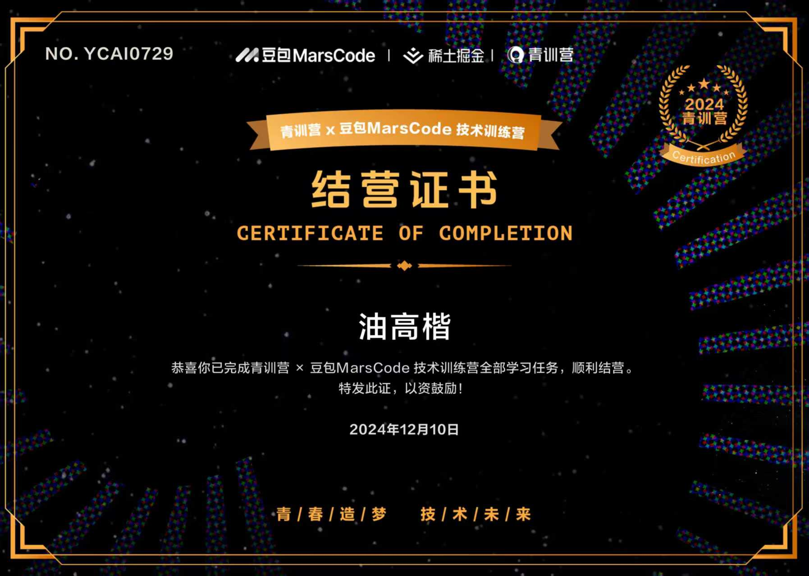
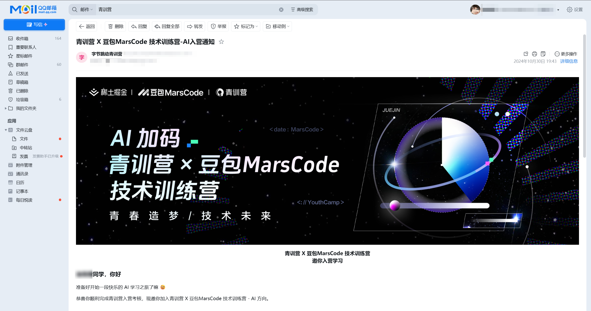

# Honors & Certificates

[← Back to Profile](README.md)

A collection of my open source contributions, competition results, and completed training programs. Supporting certificates and email records are organized below.

## 01 · Apache Fory Committer

**Apache Fory Committer** · [Official Website ↗](https://fory.apache.org/)

### Committer invitation

### Apache Software Foundation account confirmation

## 02 · Spring AI

**[PR #7062 · Keep selected tools declared during tool search](https://github.com/spring-projects/spring-ai/pull/7062)** · [Official Website ↗](https://spring.io/projects/spring-ai)

Submitted a PR to keep core tools declared throughout tool-search interactions. See the PR page for the latest review and merge status.

The linked pull request is the contribution record.

## 03 · Tianchi Cloud-Native Programming Challenge

**2024 Tianchi Cloud-Native Programming Challenge · 2nd Place, Track 3 Preliminary Round** · [Alibaba Cloud Tianchi ↗](https://tianchi.aliyun.com/competition)

### Preliminary-round certificate

## 04 · Tencent Rhino-Bird Open Source Talent Development Program

**Selected for and completed the 2024 Tencent Rhino-Bird Open Source Talent Development Program (tRPC-Cpp project); awarded a certificate for hands-on open source practice.**

[Official Website ↗](https://opensource.tencent.com/summer-of-code) · [Official tRPC-Cpp Repository ↗](https://github.com/trpc-group/trpc-cpp)

### tRPC-Cpp project admission

### Open source practice certificate

### Completion notification

## 05 · Youth Training Camp × Doubao MarsCode Technical Bootcamp

**Completed the Youth Training Camp × Doubao MarsCode Technical Bootcamp and received a certificate of completion.**

Juejin × Doubao MarsCode, December 2024 · [Juejin ↗](https://juejin.cn/) · [MarsCode ↗](https://www.marscode.cn/)

### Certificate of completion

### Admission notification

