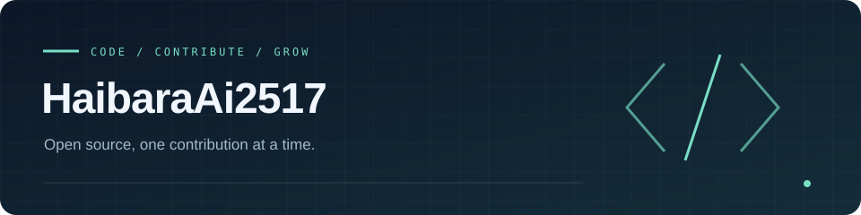

  

  <strong>在开源中打磨技术，在实践中积累答案。</strong>

  <a href="https://fory.apache.org/">Apache Fory</a> &nbsp; / &nbsp;
  <a href="https://spring.io/projects/spring-ai">Spring AI</a> &nbsp; / &nbsp;
  <a href="Awards.md">荣誉与证明材料 ↗</a>

---

## 荣誉与足迹

### `01` 开源贡献 · Open Source

- **Apache Fory Committer** · [项目官网 ↗](https://fory.apache.org/)
- **Spring AI · [PR #7062](https://github.com/spring-projects/spring-ai/pull/7062)** · [项目官网 ↗](https://spring.io/projects/spring-ai)  
  为工具搜索场景补充核心工具持续声明能力，已提交 PR。

### `02` 竞赛成绩 · Competition

- **2024 天池云原生编程挑战赛 · 赛道 3 初赛第 1 名** · [阿里云天池官网 ↗](https://tianchi.aliyun.com/competition)

### `03` 培养计划 · Learning & Practice

- **2024 腾讯犀牛鸟开源人才培养计划 · OMI 课题** · [计划官网 ↗](https://opensource.tencent.com/summer-of-code) · [OMI 官方仓库 ↗](https://github.com/Tencent/omi)  
  入选并完成培养计划，获开源实战证书。
- **青训营 × 豆包 MarsCode 技术训练营 · 结营证书** · [稀土掘金官网 ↗](https://juejin.cn/) · [MarsCode 官网 ↗](https://www.marscode.cn/)  
  稀土掘金 × 豆包 MarsCode，2024.12。

---

**[查看证明材料 →](Awards.md)**  
证书、成绩截图与开源贡献记录，集中收录于独立页面。

